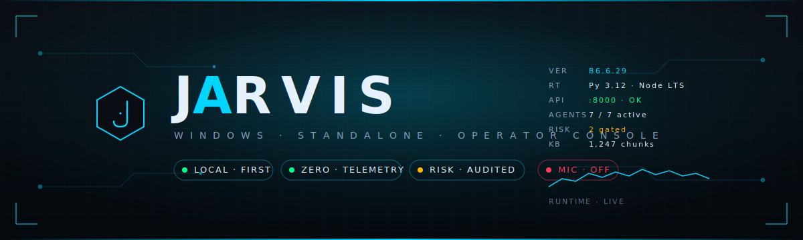
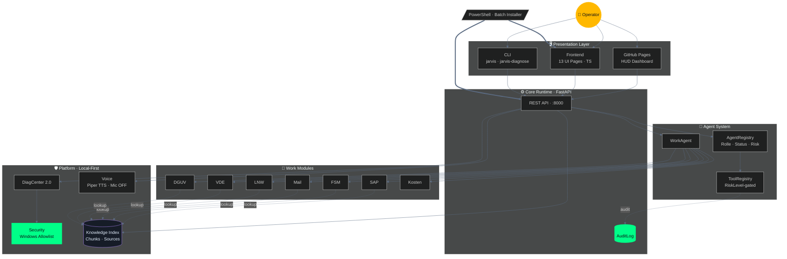

<p align="center">
  
</p>

<p align="center">
  <a href="https://github.com/xpozer/jarvis-windows-standalone/actions/workflows/ci.yml"></a>
  
  
  
  
</p>

<p align="center">
  <b>Modularer Windows-Standalone-Assistent für Elektro-Arbeitsplanung in der Chemieindustrie.</b><br/>
  SAP · FSM · Mail · LNW · VDE · DGUV · Kosten · Knowledge · DiagCenter · Voice
</p>

<p align="center">
  <a href="https://xpozer.github.io/jarvis-windows-standalone/"><b>🖥 Live-Dashboard</b></a> &nbsp;·&nbsp;
  <a href="#quick-install"><b>⚡ Quick Install</b></a> &nbsp;·&nbsp;
  <a href="#architektur"><b>🧭 Architektur</b></a> &nbsp;·&nbsp;
  <a href="CHANGELOG.md"><b>📜 Changelog</b></a>
</p>

---

<table>
<tr>
<td width="33%" align="center">
<h3>🛡 Local-First</h3>
Keine externe Telemetrie.<br/>Daten bleiben auf dem Arbeitsgerät.
</td>
<td width="33%" align="center">
<h3>⚖ Risk-Audited</h3>
Jedes Tool hat ein <code>RiskLevel</code>.<br/>Aktionen laufen durch das AuditLog.
</td>
<td width="33%" align="center">
<h3>🎙 Mic OFF by Default</h3>
Voice nur nach bewusster Aktivierung.<br/>Push-to-Talk als Standard.
</td>
</tr>
</table>

> _JARVIS is a modular Windows standalone assistant for professional electrical work planning in the chemical industry. Local-first, zero telemetry, risk-audited tools._

## Dashboard Vorschau

Das HUD-Dashboard läuft unter [`docs/index.html`](docs/index.html) und ist live unter [xpozer.github.io/jarvis-windows-standalone](https://xpozer.github.io/jarvis-windows-standalone/) erreichbar.


## Features nach Block Roadmap

| Block | Bereich | Inhalt |
|---|---|---|
| B1 | Fundament | Projektstruktur, lokale Konfiguration, Basisschnittstellen, Runtime Grundlagen |
| B2 | AgentSystem | AgentRegistry mit Status, Rolle und Risiko, ToolRegistry mit RiskLevel, AuditLog |
| B3 | WorkAgent und Knowledge | SAP, Mail, LNW, FSM, VDE, DGUV, Kosten Module, Knowledge Index mit Chunks und Sources |
| B4 | DiagCenter 2.0 und Security | Diagnoseoberfläche, Windows Allowlist, Sicherheitsregeln, lokale Prüfmechanismen |
| B5 | Dashboard und UI | 13 UI Pages, Live Telemetrie, GitHub Pages Bootscreen, Dashboard unter docs/index.html |
| B6 | Installer und QA | Windows Installer, Maintenance Skripte, Tests, ZIP Builds je lauffähigem Block |

## Quick Install

```bat
INSTALL_JARVIS.bat
```

Falls Windows Skripte blockiert, starte die Batch Datei über ein Terminal mit normalen Benutzerrechten. Der Installer soll PowerShell intern mit passender Execution Policy starten.

## Systemanforderungen

| Komponente | Empfehlung |
|---|---|
| Betriebssystem | Windows 10 oder Windows 11 |
| Python | 3.11 oder 3.12 |
| Node.js | Aktuelle LTS Version |
| PowerShell | Windows PowerShell 5.1 oder PowerShell 7 |
| Speicher | Mindestens 4 GB RAM, empfohlen 8 GB |
| Netzwerk | Für Installation und Updates erforderlich, Betrieb lokal möglich |
| Audio | Optional für Voice Modul und Piper TTS |

## Voraussetzungen

Installiere vor der lokalen Entwicklung:

```powershell
python --version
node --version
npm --version
powershell $PSVersionTable.PSVersion
```

Python Umgebung vorbereiten:

```powershell
py -3.11 -m venv .venv
.venv\Scripts\activate
python -m pip install --upgrade pip
pip install -e .[dev]
```

## Installation

Klonen:

```powershell
git clone https://github.com/xpozer/jarvis-windows-standalone.git
cd jarvis-windows-standalone
```

Installer starten, sobald die Installer Dateien im Root vorhanden sind:

```bat
INSTALL_JARVIS.bat
```

Frontend Abhängigkeiten installieren und Build prüfen:

```powershell
cd frontend
npm install
npm run typecheck
npm run build
```

## Erste Schritte

Backend CLI prüfen:

```powershell
jarvis version
jarvis status
```

Backend API lokal starten:

```powershell
jarvis-api
```

Health Check im Browser oder per PowerShell:

```powershell
Invoke-RestMethod http://127.0.0.1:8000/health
```

DiagCenter Smoke Check:

```powershell
jarvis-diagnose smoke
```

Frontend im Entwicklungsmodus starten:

```powershell
cd frontend
npm run dev
```

Dashboard lokal öffnen:

```text
docs/index.html
```

GitHub Pages Dashboard:

```text
https://xpozer.github.io/jarvis-windows-standalone/
```

## Konfiguration

JARVIS nutzt lokale Konfigurationen. Ziel ist eine transparente Struktur mit JSON Dateien für Registry, Tools, Agenten, Audit und Knowledge.

Geplante Kernkonfiguration:

```text
config/
  app.json
  agents.json
  tools.json
  security.json
  voice.json
  knowledge.json
```

Wichtige Prinzipien:

| Bereich | Regel |
|---|---|
| Voice | Mikrofon standardmäßig aus |
| AuditLog | Lokale Protokollierung |
| ToolRegistry | Jedes Tool bekommt ein RiskLevel |
| AgentRegistry | Jeder Agent bekommt Rolle, Status und Risiko |
| Security | Windows Allowlist für erlaubte lokale Aktionen |
| Knowledge | Lokaler Index mit Chunks und Sources |

## Diagnose

DiagCenter 2.0 soll prüfen:

| Prüfung | Ziel |
|---|---|
| Python Runtime | Richtige Version und virtuelle Umgebung |
| Node Runtime | Frontend Buildfähigkeit |
| PowerShell | Skriptfähigkeit und Execution Policy |
| Ports | Backend und Frontend Erreichbarkeit |
| Dateien | Vorhandensein der Konfigurationsdateien |
| Logs | Lesbarkeit und Fehleranalyse |
| Knowledge Index | Status der lokalen Wissensdaten |
| Voice | Piper TTS und Mikrofonstatus |

Aktueller Smoke Check:

```powershell
jarvis-diagnose smoke
```

Geplanter Skript Pfad:

```powershell
scripts\maintenance\diagnose.ps1
```

## Update

Empfohlener Ablauf nach Einführung der Maintenance Skripte:

```powershell
git pull
scripts\maintenance\update.ps1
```

Der Update Prozess soll prüfen:

| Schritt | Zweck |
|---|---|
| Backup | Lokale Konfiguration sichern |
| Dependencies | Python und Node Pakete aktualisieren |
| Frontend | Bundle neu bauen |
| Tests | Schnelltest ausführen |
| Diagnose | Systemstatus prüfen |

## Deinstallation

Geplanter Ablauf:

```powershell
scripts\maintenance\uninstall.ps1
```

Die Deinstallation soll Programmdateien entfernen, aber lokale Daten nur nach Rückfrage löschen.

Schützenswerte lokale Daten:

```text
config/
logs/
audit/
knowledge_index/
```

## Voice Modul und Datenschutz

Das Voice Modul nutzt Piper TTS für lokale Sprachausgabe. Das Mikrofon bleibt standardmäßig ausgeschaltet.

Gründe:

| Entscheidung | Zweck |
|---|---|
| Mikrofon standardmäßig aus | Datenschutz und Kontrolle |
| Push to Talk als Standard | Keine dauerhafte Audioaufnahme |
| Wake Word nur optional | Aktivierung nur nach bewusster Konfiguration |
| Local first | Keine externe Telemetrie |

## Architektur



## Roadmap

```mermaid
---
config:
  theme: dark
---
gantt
    title JARVIS Block Roadmap
    dateFormat  X
    axisFormat  %s
    section Foundation
    B1 Fundament              :done, b1, 0, 1
    B2 AgentSystem            :done, b2, 1, 1
    section Domain
    B3 WorkAgent · Knowledge  :done, b3, 2, 1
    B4 DiagCenter · Security  :done, b4, 3, 1
    section Surface
    B5 Dashboard · UI         :active, b5, 4, 1
    B6 Installer · QA         :b6, 5, 1
```



| Status | Block | Ziel |
|---|---|---|
| ✅ | **B1 Fundament** | Stabile lokale Basis, Konfiguration, Start und Runtime |
| ✅ | **B2 AgentSystem** | AgentRegistry, ToolRegistry, AuditLog und RiskLevel |
| ✅ | **B3 WorkAgent · Knowledge** | SAP, FSM, Mail, LNW, VDE, DGUV, Kosten und Knowledge Index |
| ✅ | **B4 DiagCenter · Security** | Diagnose, Security, Windows Allowlist, lokale Prüfung |
| 🚧 | **B5 Dashboard · UI** | 13 UI Pages, Telemetrie, GitHub Pages Dashboard |
| ⏳ | **B6 Installer · QA** | Installer, Tests, Release ZIPs und Qualitätssicherung |

## Tests

Backend Tests:

```powershell
pytest
```

Frontend Check:

```powershell
cd frontend
npm install
npm run typecheck
npm run build
```

## Entwicklung

Empfohlener Ablauf:

```powershell
git checkout main
git pull
git checkout -b feature/mein-thema
```

Vor einem Pull Request:

```powershell
ruff check .
black --check .
pytest
cd frontend
npm install
npm run typecheck
npm run build
```

## Mitwirken

Bitte lies zuerst:

```text
CONTRIBUTING.md
```

Dort stehen Branch Strategie, Commit Konventionen, lokales Testen und Pull Request Hinweise.

## Sicherheit

Bitte melde Sicherheitslücken nicht öffentlich als Issue.

Details stehen in:

```text
SECURITY.md
```

JARVIS ist als lokales Tool geplant. Es sendet keine Telemetrie nach außen.

## Lizenz

Dieses Projekt steht unter der MIT License.

Details stehen in:

```text
LICENSE
```

Copyright Julien Negro.
