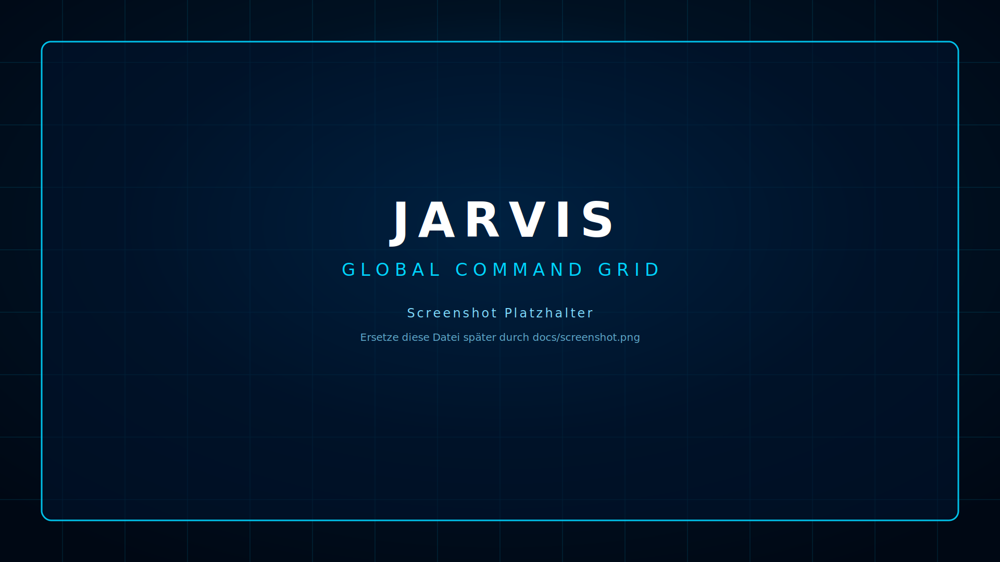
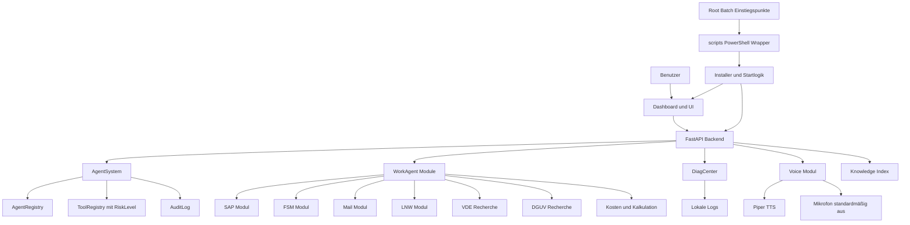

# JARVIS Windows Standalone


JARVIS ist ein modularer Windows Standalone Assistent für den beruflichen Einsatz in der Chemieindustrie im Bereich Elektro Arbeitsplanung. Er unterstützt bei SAP, FSM, Mail, Leistungsnachweisen, technischen Berechnungen, VDE und DGUV Recherche, Diagnose und lokaler Wissensverwaltung.

JARVIS is a modular Windows standalone assistant for professional electrical work planning in the chemical industry. It helps with SAP, FSM, email workflows, service records, technical calculations, VDE and DGUV research, diagnostics and local knowledge management.

Version: B6.5.1
Plattform: Windows 10 und Windows 11
Betriebsart: Local first, keine externe Telemetrie

## Quick Install

Für Endnutzer bleiben nur sechs Batch Einstiegspunkte sichtbar im Root:

```text
INSTALL_JARVIS.bat
START_JARVIS.bat
UPDATE_JARVIS.bat
UNINSTALL_JARVIS.bat
DIAGNOSE.bat
REPAIR.bat
```

Installation per Doppelklick oder Terminal:

```bat
INSTALL_JARVIS.bat
```

Falls Windows Skripte blockiert, starte die Batch Datei über ein Terminal mit normalen Benutzerrechten. Die Batch Wrapper starten PowerShell intern mit `-ExecutionPolicy Bypass`.

## Skriptstruktur

Der Root bleibt bewusst schlank. Operative PowerShell Logik liegt unter `scripts/`.

```text
scripts/install/
  INSTALL_JARVIS.ps1
  FIRST_SETUP.ps1
  PRODUCT_INSTALLER.ps1
  REPAIR.ps1
  JARVIS_INSTALL_CONFIG.json

scripts/maintenance/
  CHECK_GITHUB_UPDATE.ps1
  SELF_CHECK.ps1
  check-installer-readiness.ps1
  setup-lifeos-config.ps1

scripts/dev/
  START_JARVIS.ps1
  START_DEV_FRONTEND.bat
  START_FRONTEND_CMD.bat

scripts/lib/
  Invoke-JarVISCore.ps1
```

Die Root Batch Dateien übergeben den Projekt Root explizit an die PowerShell Wrapper. Dadurch funktionieren die verschobenen Skripte weiterhin aus einem Windows Checkout und aus einer installierten Kopie.

## Dashboard Vorschau

Das GitHub Pages Dashboard liegt unter:

```text
docs/index.html
```



## Features nach Block Roadmap

| Block | Bereich | Inhalt |
|---|---|---|
| B1 | Fundament | Projektstruktur, lokale Konfiguration, Basisschnittstellen, Runtime Grundlagen |
| B2 | AgentSystem | AgentRegistry mit Status, Rolle und Risiko, ToolRegistry mit RiskLevel, AuditLog |
| B3 | WorkAgent und Knowledge | SAP, Mail, LNW, FSM, VDE, DGUV, Kosten Module, Knowledge Index mit Chunks und Sources |
| B4 | DiagCenter 2.0 und Security | Diagnoseoberfläche, Windows Allowlist, Sicherheitsregeln, lokale Prüfmechanismen |
| B5 | Dashboard und UI | 13 UI Pages, Live Telemetrie, GitHub Pages Bootscreen, Dashboard unter docs/index.html |
| B6 | Installer und QA | Windows Installer, Maintenance Skripte, Tests, ZIP Builds je lauffähigem Block |

## Systemanforderungen

| Komponente | Empfehlung |
|---|---|
| Betriebssystem | Windows 10 oder Windows 11 |
| Python | 3.11 oder 3.12 |
| Node.js | Aktuelle LTS Version |
| PowerShell | Windows PowerShell 5.1 oder PowerShell 7 |
| Speicher | Mindestens 4 GB RAM, empfohlen 8 GB |
| Netzwerk | Für Installation und Updates erforderlich, Betrieb lokal möglich |
| Audio | Optional für Voice Modul und Piper TTS |

## Voraussetzungen für Entwicklung

```powershell
python --version
node --version
npm --version
powershell $PSVersionTable.PSVersion
```

Python Umgebung vorbereiten:

```powershell
py -3.11 -m venv .venv
.venv\Scripts\activate
python -m pip install --upgrade pip
pip install -e .[dev]
```

Frontend prüfen:

```powershell
cd frontend
npm install
npm run typecheck
npm run build
```

## Installation

Klonen:

```powershell
git clone https://github.com/xpozer/jarvis-windows-standalone.git
cd jarvis-windows-standalone
```

Installer starten:

```bat
INSTALL_JARVIS.bat
```

Der Root Wrapper ruft intern auf:

```powershell
scripts\install\INSTALL_JARVIS.ps1
```

## Start

JARVIS starten:

```bat
START_JARVIS.bat
```

Der Root Wrapper ruft intern auf:

```powershell
scripts\dev\START_JARVIS.ps1
```

Frontend im Entwicklungsmodus starten:

```bat
scripts\dev\START_DEV_FRONTEND.bat
```

Oder manuell:

```powershell
cd frontend
npm run dev
```

## Diagnose

Schnelle Diagnose per Root Einstiegspunkt:

```bat
DIAGNOSE.bat
```

Self Check:

```powershell
scripts\maintenance\SELF_CHECK.ps1
```

Installer Readiness Check:

```powershell
powershell -ExecutionPolicy Bypass -File scripts\maintenance\check-installer-readiness.ps1
```

Backend Health Check im Browser oder per PowerShell:

```powershell
Invoke-RestMethod http://127.0.0.1:8000/health
```

DiagCenter:

```powershell
Invoke-RestMethod http://127.0.0.1:8000/diagnostic/center
```

## Update

Update per Root Einstiegspunkt:

```bat
UPDATE_JARVIS.bat
```

Privates GitHub Release prüfen:

```powershell
scripts\maintenance\CHECK_GITHUB_UPDATE.ps1
```

Update anwenden:

```powershell
scripts\maintenance\CHECK_GITHUB_UPDATE.ps1 -Apply
```

## Reparatur

```bat
REPAIR.bat
```

Der Root Wrapper ruft intern auf:

```powershell
scripts\install\REPAIR.ps1
```

## Deinstallation

```bat
UNINSTALL_JARVIS.bat
```

Der Root Wrapper ruft intern auf:

```powershell
scripts\install\PRODUCT_INSTALLER.ps1 -Mode Uninstall -KeepData
```

Die Deinstallation entfernt Programmdateien. Lokale Daten werden mit `-KeepData` geschützt.

Schützenswerte lokale Daten:

```text
config/
logs/
audit/
knowledge_index/
data/
```

## Konfiguration

JARVIS nutzt lokale Konfigurationen. Ziel ist eine transparente Struktur mit JSON Dateien für Registry, Tools, Agenten, Audit und Knowledge.

Geplante Kernkonfiguration:

```text
config/
  app.json
  agents.json
  tools.json
  security.json
  voice.json
  knowledge.json
```

Wichtige Prinzipien:

| Bereich | Regel |
|---|---|
| Voice | Mikrofon standardmäßig aus |
| AuditLog | Lokale Protokollierung |
| ToolRegistry | Jedes Tool bekommt ein RiskLevel |
| AgentRegistry | Jeder Agent bekommt Rolle, Status und Risiko |
| Security | Windows Allowlist für erlaubte lokale Aktionen |
| Knowledge | Lokaler Index mit Chunks und Sources |

## Voice Modul und Datenschutz

Das Voice Modul nutzt Piper TTS für lokale Sprachausgabe. Das Mikrofon bleibt standardmäßig ausgeschaltet.

| Entscheidung | Zweck |
|---|---|
| Mikrofon standardmäßig aus | Datenschutz und Kontrolle |
| Push to Talk als Standard | Keine dauerhafte Audioaufnahme |
| Wake Word nur optional | Aktivierung nur nach bewusster Konfiguration |
| Local first | Keine externe Telemetrie |

## Architektur



## Roadmap

| Status | Block | Ziel |
|---|---|---|
| [ ] | B1 Fundament | Stabile lokale Basis, Konfiguration, Start und Runtime |
| [ ] | B2 AgentSystem | AgentRegistry, ToolRegistry, AuditLog und RiskLevel |
| [ ] | B3 WorkAgent und Knowledge | SAP, FSM, Mail, LNW, VDE, DGUV, Kosten und Knowledge Index |
| [ ] | B4 DiagCenter 2.0 und Security | Diagnose, Security, Windows Allowlist, lokale Prüfung |
| [ ] | B5 Dashboard und UI | 13 UI Pages, Telemetrie, GitHub Pages Dashboard |
| [ ] | B6 Installer und QA | Installer, Tests, Release ZIPs und Qualitätssicherung |

## Tests

Backend Tests:

```powershell
pytest
```

Frontend Check:

```powershell
cd frontend
npm install
npm run typecheck
npm run build
```

Vor einem Pull Request:

```powershell
ruff check .
black --check .
pytest
cd frontend
npm install
npm run typecheck
npm run build
```

## Mitwirken

Bitte lies zuerst:

```text
CONTRIBUTING.md
```

## Sicherheit

Bitte melde Sicherheitslücken nicht öffentlich als Issue.

Details stehen in:

```text
SECURITY.md
```

JARVIS ist als lokales Tool geplant. Es sendet keine Telemetrie nach außen.

## Lizenz

Dieses Projekt steht unter der MIT License.

Details stehen in:

```text
LICENSE
```

Copyright Julien Negro.
